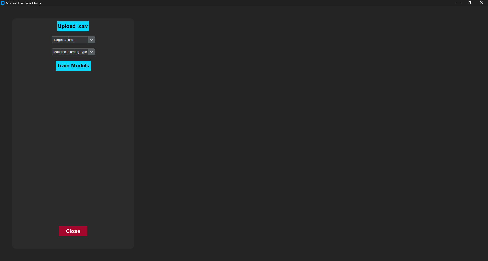
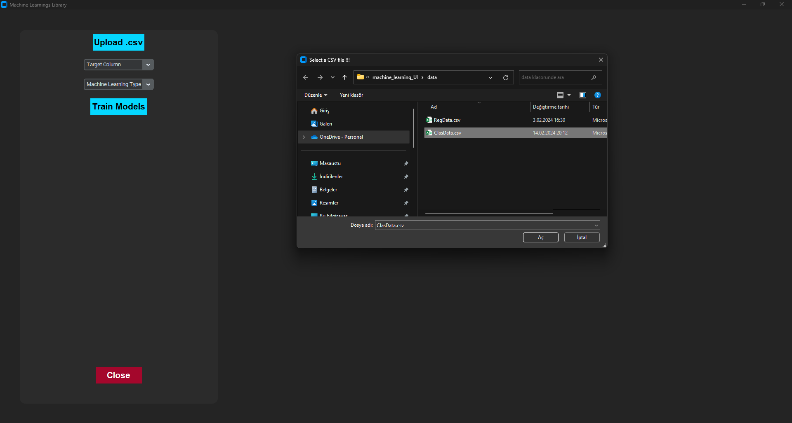

# Machine Learning UI(User Interface)

I have a good news for you who don't know how to code but want to use
machine learning models. I have created a friendly user interface for you.
You can use the machine learning models without writing a single line of code. Just follow the steps below.

## Steps to use the Machine Learning UI

1. Clone the repository

```bash
git clone https//:github.com/fawern/machine_learning_UI.git
```

3. Go to the machine_learning_UI directory

```bash
cd machine_learning_UI
```

3. Install the required libraries

```bash
pip install -r requirements.txt
```

4. Run the app

```bash
python app.py
```

#### When you run the app, you will see the following screen.



5. Upload the dataset.

   - Click the UPLOAD .csv button and upload the dataset as shown below.
     

6. Select the target column

   - Choose the target column from the dropdown list as shown below.
     

7. Select the model

   - Choose the model from the dropdown list as shown below.
     

8. Click the Train button
   - Click the Train button to train the model and see the results as shown below.
     
