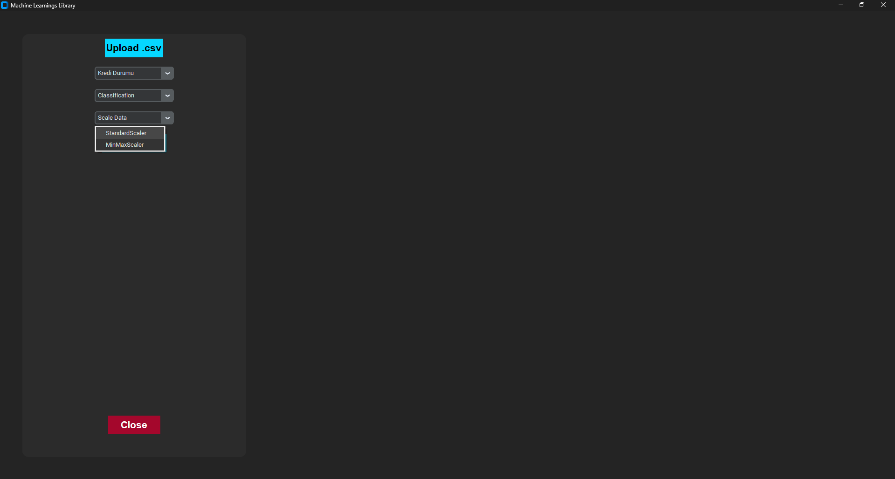

# Machine Learning UI (User Interface)

Welcome to the Machine Learning UI, a user-friendly interface for utilizing machine learning models without any coding knowledge required.

## Usage Instructions

### Step 1: Setup

1. **Clone the repository**:

   ```bash
   git clone https://github.com/fawern/machine_learning_UI.git
   ```

2. **Navigate to the directory**:

   ```bash
   cd machine_learning_UI
   ```

3. **Install required libraries**:
   ```bash
   pip install -r requirements.txt
   ```

### Step 2: Run the App

4. **Start the application**:

   ```bash
   python app.py
   ```

   

### Step 3: Data Preparation

5. **Upload your dataset**:

   - Click the "UPLOAD .csv" button to select and upload your dataset.
     

6. **Select the target column**:
   - Choose the target column from the dropdown list.
     

### Step 4: Model Selection and Training

7. **Choose the model**:

   - Select the machine learning model from the dropdown list.
     

8. **Set the Scaler**:

   - Choose the scaler from the dropdown list.
     

9. **Train the model-View Results**:

   - Click the "Train" button to initiate the training process.
   - Once the training is complete, the results will be displayed on the screen.

   
   

### Video Tutorial


<video src="./imgs/video.mp4" controls>
  Your browser does not support the video tag.
</video>
